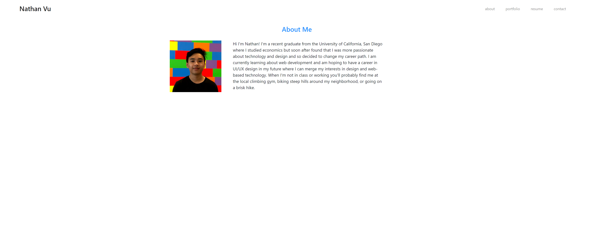
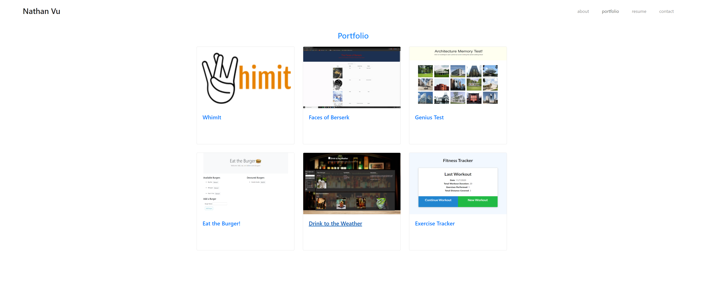
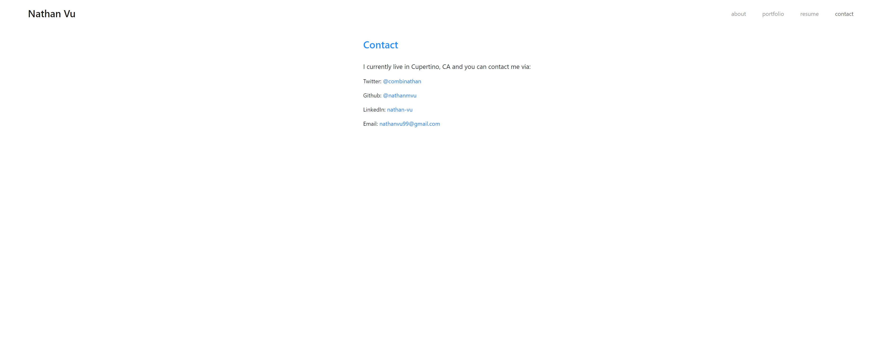

# React Portfolio

## Description
My React-based Portfolio containing some information about me and some of the projects I've created. It currently features three pages: About, Portfolio, and Contact.

## Table of Contents
* [Getting Started](#getting-started)
* [Installation](#installation)
* [Usage](#usage)
* [Author](#author)
* [Acknowledgments](#acknowledgments)
* [License](#license)

## Getting Started
* [Github Repository](https://github.com/nathanmvu/my-react-portfolio)
* [Deployed Link](https://nathanmvu.github.io/my-react-portfolio/)
* [Usage Demo Video](https://drive.google.com/file/d/1T2M46MpTV96ract3qnfD_b6ppJySi7uo/view)


## Installation
To run the program, install it from the repository and then navigate to the App.js file in the src folder. In an integrated terminal run
`npm start`
and the program will launch in a web browser.

## Usage
About Page:


Portfolio Page:


Contact Page:


### Code Snippet
The code written to populate the cards on the portfolio page with project information.
```
import React from 'react';
import './Portfolio.css'
import projects from './projects.json';

function Portfolio() {
  return (
    <div class='container'>
      <div class="d-flex justify-content-center">
        <h3>Portfolio</h3>
      </div>
      <div className='row'>
        {projects.map(project => 
        <div key={project.id} class="card-deck">
          <div class='card'>
            <a href={project.deployed} target="blank_"></a>
            <div class="card-body">
              <h5 class="card-title"><a href={project.github}>{project.title}</a></h5>
            </div>
          </div>
        </div>
        )}
      </div>
    </div>
  )
}

export default Portfolio;

```

## Author
Nathan Vu
* [Github](https://github.com/nathanmvu)
* [Email](mailto:nathanvu99@gmail.com)

## Acknowledgments
* Project parameters provided by the UCB Extension Coding Bootcamp

## License
[](https://github.com/tterb/atomic-design-ui/blob/master/LICENSEs)

